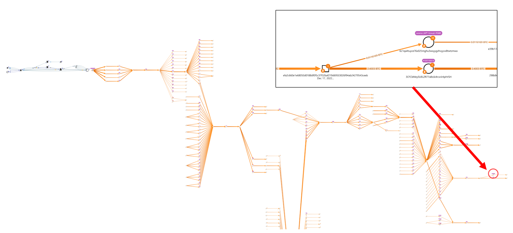

# Apollo X 거래소 해킹 공격자 주소 추적

1\. 사건 개요

<figure><figcaption>
[그림 1] Apollo X 거래소 해킹 관련 <a href="http://coinreaders.com/35680">coinreaders </a>기사
</figcaption></figure>

### 1-1) 공격 관련 정보

* 2022년 6월 8일 19시 경(UTC+8) Apollo X 거래소 대상으로 공격 발생
* 공격자의 ETH 주소 - 0x9e532b19abd155ae5ced76ca2a206a732c68f261
* ApolloxExchangeTreasury의 claim() 함수를 반복적으로 호출하여 계약에서 약 5,300만 APX 토큰을 획득(서명 확인 취약점), 당시 약210만 달러에 해당하는 가치로 알려짐
* claim() 함수는 ECDSA.recover()로 입력 메시지와 서명을 성공적으로 검증하고 계약에서 공격자에게 해당 토큰 양을 전송
* 획득한 APX 토큰을 PancakeSwap을 통해 공격 당시 약 160만 개의 BUSD로 변환
* PancakeSwap 과정 중 총 8건의 트랜잭션을 수행
* 확보한 BUSD는 3건의 ZAP Bridge 트랜잭션을 통해 nUSD로 변환
* nUSD를 USDC 토큰으로 변환
* USDC를 DAI 토큰으로 변환
* DAI를 renBTC로 변환
* renBTC를 BTC로 변환 후 여러 주소에 나누어 전송


APX 토큰과 BUSD는 모두 Binance Chain에서 발행된 BEP-20 기반의 토큰이다.



PancakeSwap은 Binance Chain 상에서 서로 다른 토큰 간의 교환을 가능하게 해주는 일종의 DEX이다.



ZAP Bridge는 서로 다른 블록체인 간의 토큰 교환을 가능하게 해주는 일종의 프로토콜이다.


### 1-2) Apollo X 측의 대응

* 사건 당일 해킹을 당했다고 공식적으로 발표
* 4 시간 동안 DEX에서 출금 기능을 일시적으로 비활성화
* 문제 해결 후 DEX에서 출금 기능 재개
* 거래소 사용자의 자금에는 손실이 없다고 발표
* 거래소 수수료로 얻은 APX를 통해 손실을 만회할 계획이라고 발표

### 1-3) Apollo X 트위터 공식 입장


Apollo X 트위터 공식 입장1



Apollo X 트위터 공식 입장2


## 2. Apollo X 거래소에서 유출된 암호화폐 추적


탈취한 APX를 BUSD로 전환하기까지의 과정


공격자가 탈취한 APX 토큰을 Pancake Swap을 사용해서 약 160만 개의 BUSD 토큰으로 변환하기까지의 과정을 위 시트와 같이 정리했다.

공격자는 전환한 BUSD 토큰을 ZAP Bridge를 사용해서 nUSD 토큰으로 변환했으며, 그 과정은 아래 트랜잭션에서 확인할 수 있다.

* [https://bscscan.com/tx/0x3d141a94a914947b3cc611f3e44d81be9f3147a9afaf168c57c4b5c638b16f71](https://bscscan.com/tx/0x3d141a94a914947b3cc611f3e44d81be9f3147a9afaf168c57c4b5c638b16f71)
* [https://bscscan.com/tx/0x07e4438429c55cfc1d1b2fcb8eb10cadc579d0b16c7b78af78a26448bc8b1d28](https://bscscan.com/tx/0x07e4438429c55cfc1d1b2fcb8eb10cadc579d0b16c7b78af78a26448bc8b1d28)
* [https://bscscan.com/tx/0x25ee8fc7d26ef11bce3d546517134b125d306f00bba253a2c13e6dcdc35b64f2](https://bscscan.com/tx/0x25ee8fc7d26ef11bce3d546517134b125d306f00bba253a2c13e6dcdc35b64f2)

<figure><figcaption>
[그림 2] nUSD -> USDC 전환과정
</figcaption></figure>

\[그림 2]와 같이 nUSD 토큰이 3 차례에 걸쳐 스마트 컨트랙트에 의해 USDC 토큰으로 전환된 것을 알 수 있다. USDC 토큰은 공격자의 주소로 전송됐다.

* 0x9e532b19abd155ae5ced76ca2a206a732c68f261

<figure><figcaption>
[그림 3] USDC -> DAI 전환 과정
</figcaption></figure>

변환된 USDC는 \[그림 3]과 같이 스마트 컨트랙트에 의해 DAI 토큰으로 변환됐다.

<figure><figcaption>
[그림 4] DAI -> renBTC 변환 과정
</figcaption></figure>

변환된 DAI는 \[그림 4]와 같이 스마트 컨트랙트에 의해 renBTC 토큰으로 변환됐다.

<figure><figcaption>
[그림 5] renBTC -> BTC 변환 과정
</figcaption></figure>

마찬가지로 72.94215535 renBTC는 스마트 컨트랙트에 의해 72.87 BTC로 변환되었으며 5개의 트랜잭션으로 나뉘어져 다음 공격자 주소로 전송됐다.

* bc1qew8rvlexmwlhwa97ulhyvg8fk2ngj9yrrd2t80

<figure><figcaption>
[그림 6] 자금 추적을 회피하는 행위
</figcaption></figure>

공격자는 변환한 비트코인을 여러 주소에 나누어 전송하는 방법을 통해 추적을 회피하려고 한 것을 알 수 있다.

<figure><figcaption>
[그림 7] Lazarus 그룹이 소유한 주소로 이어지는 모습
</figcaption></figure>

다수의 트랜잭션 중 일부 트랜잭션을 확장해서 추적해본 결과, 북한 해커 그룹으로 알려져 있는 Lazarus 그룹이 소유한 주소로 일부 자금이 전송된 것을 확인할 수 있었다.

해당 트랜잭션 과정은 다음과 같다.

* <mark style="background-color:orange;">bc1qew8rvlexmwlhwa97ulhyvg8fk2ngj9yrrd2t80</mark> (ApolloX Hacker Address)
* 94ebd5715184d7c3c82cf55d9502dab02da7fae494abf79fd0873cfd8e6b1624
* 192bef7297097ce3c3c98f8577c3672f266ff17a7b9a5d53c913726339841c58
* 94f4f66f18a05e3bf4f8a5cd380b4f4e8383fe03f025dd97e9d9129d0f8bfd35
* 7d6ad4cd9feaf2974cf4865fd991ddc242575c0245f551f885895f5496c98986
* 98a22812ceff6c8ba6b19796473f3ca5a751c6318b5a251c43c48c7001c0d1da
* fe3c483b1f98379e5129b606d532d3b3f203866d79836e44532564f0a5dd4389
* 63643e568f73eb5fb4780f354da20f2d817c31a18eee25fce49c1f591ed99b0b
* 3a0a4dbfdefa5d2feaf645da63027adad48f3db7d82ea57a22b94e71bbb42be2
* 0aa9fe60eec1685b5c65ba0a4d0f20337600b49b471d83530af608579032cee8
* c9b86f2fe0ff91308fa2d750c5c2f6a5cc93a6c5040e540b59fd9c5380eaea70
* cf4f4dca2523c317f201947d0a18d509dbc73a5f6a88f5a73ba15672248b2701
* efa2c660e1e68050d0188df0f5c37f32baf219d69503026f94ab24279543ceeb
* <mark style="background-color:red;">bc1qa4tuyce76x025mghu3wxyygzhvyyvx8twtzmwa</mark> (Lazarus Group)

## 3. 결론

* ApolloX 공격자는 스마트 컨트랙트의 서명 확인 취약점을 이용해 5300만 APX 토큰을 탈취했다.
* APX 토큰은 Pancake Swap을 통해 약 160만 BUSD 토큰으로 변환됐다. (Binance Chain -> Binance Chain)
* BUSD 토큰은 ZAP Bridge를 통해 nUSD 토큰으로 변환됐다. (Binance Chain -> Ethereum Chain)
* nUSD 토큰은 USDC 토큰으로 변환됐다. (Ethereum Chain -> Ethereum Chain)
* USDC 토큰은 DAI 토큰으로 변환됐다. (Ethereum Chain -> Ethereum Chain)
* DAI 토큰은 renBTC 토큰으로 변환됐다. (Ethereum Chain -> Ethereum Chain)
* renBTC 토큰은 BTC로 변환됐다. (Ethereum Chain -> Bitcoin Chain)
* BTC는 여러 주소로 나뉘어져 전송됐으며, 그 중 일부는 Lazarus Group이 소유한 주소에도 전송됐다.

