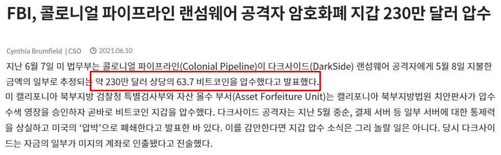

# Colonial Pipeline Ransomware 사건 주소 추적

## 1. 사건 개요

<figure><figcaption>
[그림 1] 콜로니얼 파이프라인 사건 관련 <a href="https://www.cctvnews.co.kr/news/articleView.html?idxno=229908">cctvnews</a> 기사
</figcaption></figure>

<figure><figcaption>
[그림 2] 콜로니얼 파이프라인 사건 관련 <a href="https://www.itworld.co.kr/news/197089">itworld</a> 기사
</figcaption></figure>

### 1-1) 공격 관련

* 2021년 4월 공격 그룹은 유출된 VPN 비밀번호를 사용해 미국의 정유 회사인 Colonial Pipeline 社의 컴퓨터 네트워크에 접근
* 2021년 5월 6일(현지시간) Colonial Pipeline 社의 100GB 가량 데이터가 탈취됨
* 2021년 5월 7일(현지시간) Colonial Pipeline 社에 랜섬웨어 공격 발생
* 공격 그룹은 몸값 BTC를 지불받은 후 복호화 도구 전달

### 1-2) Colonial Pipeline 측의 대응

* 랜섬웨어가 컴퓨터 시스템을 장악해 송유관을 제어하는 것을 막기 위한 예방 조치로 송유관 가동을 중단
* 2021년 5월 8일(현지시간) 해커 집단에게 75 BTC 지급 (당시 약 440만 달러)
* 2021년 5월 12일(현지시간) 송유관 가동을 재개

### 1-3) 영향

* 송유관 폐쇄로 인근 지역의 연료 부족 및 유가 상승 사태 발생
* 2021년 5월 9일(현지시간) 조 바이든 미 대통령이 비상사태를 선포
* 미 국무부는 DarkSide 회원의 체포로 이어지는 정보의 경우 $10,000,000의 보상금을 지급할 것이라는 성명을 발표
* FBI가 몸값 비트코인을 압수했다고 발표하자 비트코인 시세가 하락

### 1-4) FBI 측의 대응

* FBI는 공격 집단을 러시아에 위치를 둔 DarkSide 랜섬웨어 그룹으로 판단
* 공격 그룹에 랜섬웨어 몸값 지불 과정 지휘
* 2021년 6월 7일(현지시간) FBI는 지불된 75 BTC 중 약 63.7 BTC (당시 약 230만 달러)를 회수하는데 성공

### 1-5) Bitcoin 시세 하락

<figure><figcaption>
[그림 3] Blockstream 최고 경영자 Adam Back의 <a href="https://twitter.com/adam3us/status/1402182785205518337">Twitter</a>
</figcaption></figure>

FBI가 해커 그룹으로부터 비트코인을 압수했다고 발표한 뒤 많은 사람들은 비트코인 지갑이 해킹당했다고 생각했고, 비트코인 체계가 취약하다는 잘못된 이야기가 퍼지자 비트코인의 시세가 하락했다.

이에 Blockstream 최고 경영자 Adam Back은 트위터에 비트코인 지갑이 해킹당한 것이 아니며 이는 불가능하고, FBI가 랜섬웨어 공격자가 사용하는 클라우드 서버에 대한 제어권을 획득하고 코인을 가져온 것이라고 했다.

## 2. Colonial Pipeline 측에서 지불한 비트코인 추적

### 2-1) 비트코인 압수 영장 발부

<figure><figcaption>
[그림 4] Colonial Pipeline 랜섬웨어 감염 사건 <a href="https://www.justice.gov/d9/press-releases/attachments/2021/06/08/darkside_affidavit.pdf">관련 압수 영장</a> 중 일부
</figcaption></figure>

Colonial Pipeline 사건의 공격자로 알려진 Darkside 그룹이 소지한 비트코인에 대한 압수 영장이 발부됐다. 75 BTC가 전송되었으나 공격자 내부 트랜잭션 도중, 63.7 BTC와 11.25 BTC로 나뉘어졌고 추적 및 몰수가 가능한 63.7 BTC에 대해서 압수를 명시했다.

### 2-2) 압수 대상 비트코인 추적 과정

<figure><figcaption>
[그림 5] Colonial Pipeline 측 비트코인 전송 과정 중 일부(1)
</figcaption></figure>

2021년 5월 8일 17시 12분(UTC), Gemini 거래소의 지갑 주소 bc1quq29mutxkgxmjfdr7ayj3zd9ad0ld5mrhh89l2 에서 Darkside 랜섬웨어 그룹의 지갑 주소인 15JFh88FcE4WL6qeMLgX5VEAFCbRXjc9fr 로 75 BTC가 전송됐다.

<figure><figcaption>
[그림 6] Colonial Pipeline 측 비트코인 전송 과정 중 일부(2)
</figcaption></figure>

전송받은 75 BTC는 2번의 트랜잭션을 거치며 bc1q7eqww9dmm9p48hx5yz5gcvmncu65w43wfytpsf 주소로 이동됐다.

<figure><figcaption>
[그림 7] Colonial Pipeline 측 비트코인 전송 과정 중 일부(3)
</figcaption></figure>

75 BTC는 0677781a5079eae8e5cbd5e6d9dcc5c02da45351a3638b85c88e5e3ecdc105a7 트랜잭션에서 63.75, 11.25 BTC로 분리되어 전송됐다.

<figure><figcaption>
[그림 8] Colonial Pipeline 측 비트코인 전송 과정 중 일부(4)
</figcaption></figure>

63.7 BTC는 daf38c7b38eb0a587cf843f47000d5c294affb4f56017370ad48c5147f5e69d9 트랜잭션에서 다른 금액들과 합쳐져 bc1qq2euq8pw950klpjcawuy4uj39ym43hs6cfsegq 주소로 69.61 BTC가 전송됐다.

<figure><figcaption>
[그림 9] Colonial Pipeline 측 비트코인 전송 과정 중 일부(5)
</figcaption></figure>

2021년 6월 7일 17:45(UTC), Darkside 랜섬웨어 그룹의 지갑 주소인 bc1qq2euq8pw950klpjcawuy4uj39ym43hs6cfsegq 에서 소유 중인 69.61 BTC 중 영장에 기재되어 있는 액수인 63.7 BTC가 FBI의 지갑 주소인 bc1qpx7vyv5tp7dm0g475ev527krg764t73dh77gls 로 몰수됐다.

<figure><figcaption>
[그림 10] 63.7 BTC 전송 후 남은 비트코인 추적
</figcaption></figure>

BIG 측에서 획득한 정보에 의하면 영장에 기재된 비트코인의 양인 63.7 BTC를 제외한 5.9042 BTC도 FBI 소유의 다른 지갑 주소로 전송된 것으로 보인다. 해당 BTC는 2022년 5월 17일, bc1q6sfxpg9lsg6lutt4fwry7wn74txdm3af487k3n 주소에 전송된 후로 추가 트랜잭션이 발생하지 않았다.

<figure><figcaption>
[그림 11] 몰수된 비트코인의 행방
</figcaption></figure>

FBI의 지갑 주소로 몰수된 약 63.7 BTC는 몇 번의 트랜잭션을 거치고나서 2021년 8월 18일에 1L21V6B31zYcChfwDQjCaLoCwEGg6UQApV 주소로 전송되었는데, 해당 주소는 약 12,000 건에 해당하는 트랜잭션 횟수를 포함하고 있기 때문에 식별되지 않은 거래소의 주소로 전송된 것으로 추측된다.

### 2-3) 압수영장에 포함되지 않은 비트코인 추적 과정

<figure><figcaption>
[그림 12] 압수영장에 포함되지 않은 비트코인 추적 과정 중 일부(1)
</figcaption></figure>

앞서 전송된 75 BTC 중 63.7 BTC와 분리된 11.25 BTC는 RaaS의 사용료 지급을 위해 랜섬웨어 개발자에게 제공된 것으로 보인다. BIG에서는 bc1q2sewgrnau4e4gvceh8ykzf8lqxawpluu0k0607 를 개발자의 주소로 식별하고 있다. b0e381d02d966acbcd9224817e3db50b2bc3566e0060db36a6a17ee163152dd7 트랜잭션에서 11.25 BTC 외 다른 금액이 합쳐지면서 개발자의 주소로 107.8 BTC가 전송됐다.

<figure><figcaption>
[그림 12] 압수영장에 포함되지 않은 비트코인 추적 과정 중 일부(2)
</figcaption></figure>

107.82 BTC에서 1BTC가 다른 주소로 전송되어 트랜잭션이 분리된 것을 알 수 있다.

<figure><figcaption>
[그림 13] 압수영장에 포함되지 않은 비트코인 추적 과정 중 일부(3)
</figcaption></figure>

다음 트랜잭션에서 106.82 BTC에서 3 BTC가 분리된 것을 알 수 있다.

<figure><figcaption>
[그림 14] Peel Chain 형태의 트랜잭션
</figcaption></figure>

계속해서 전체 액수 중 일부 액수를 다른 지갑 주소로 전송하고 있는 트랜잭션 형태를 띄고 있으며 Peel Chain을 통해 암호화폐 추적을 어렵게 만드는 것을 볼 수 있다.

## 3. 결론

* Colonial Pipeline 측에서 공격자에게 전송한 75 BTC는 중간 과정에서 63.7 BTC와 11.25 BTC로 분리되었는데, 11.25 BTC는 랜섬웨어 개발자에게 사용료를 지불하기 위한 것으로 보인다.
* Colonial Pipeline 측에서 공격자에게 전송한 75 BTC 중 63.7 BTC는 발부된 압수영장에 의거해서 FBI   소유의 주소로 몰수되었다.
* FBI가 비트코인을 몰수할 수 있었던 것은 공격자가 사용한 클라우드 서버에 대한 제어권을 획득했기 때문으로 알려져 있으며, 정확한 공식 입장은 밝혀지지 않은 것으로 보인다.
* 몰수된 63.7 BTC는 몇 번의 트랜잭션을 거치고, 거래소 소유로 추정되는 주소로 전송되었다.
* 몰수 대상 주소에 존재하는 비트코인 중 63.7을 제외한 나머지는 FBI 소유의 다른 주소로 전송되었다.
* 랜섬웨어 개발자에게 전송된 11.25 BTC는 다른 비트코인과 합쳐진 후, Peel Chain 트랜잭션 형태를 띄어 추적이 어려워졌다.

